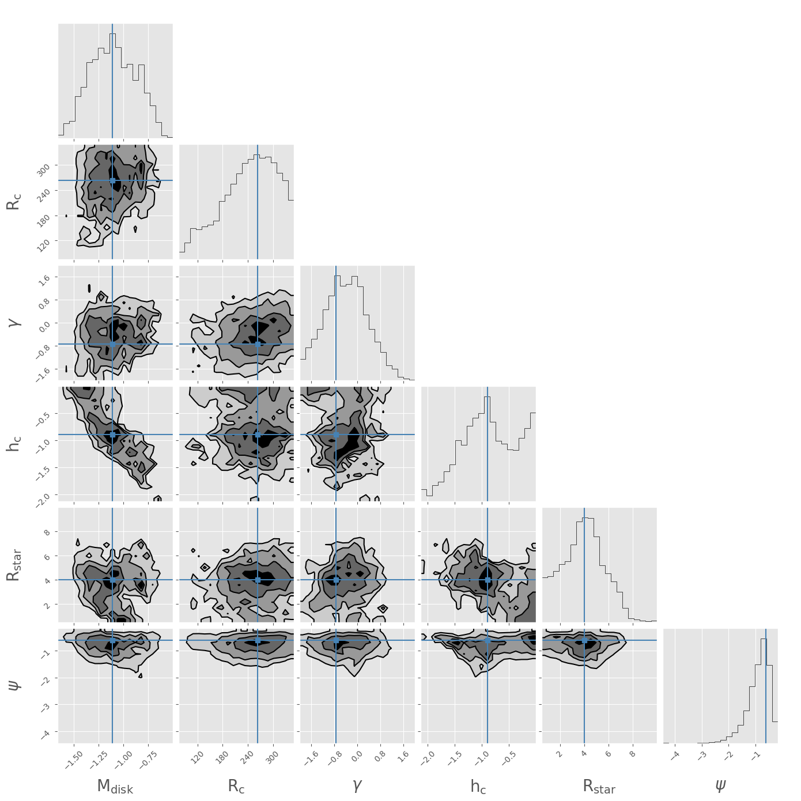
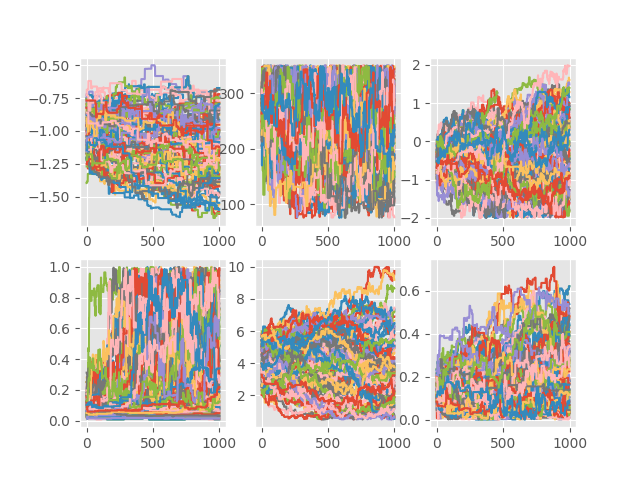
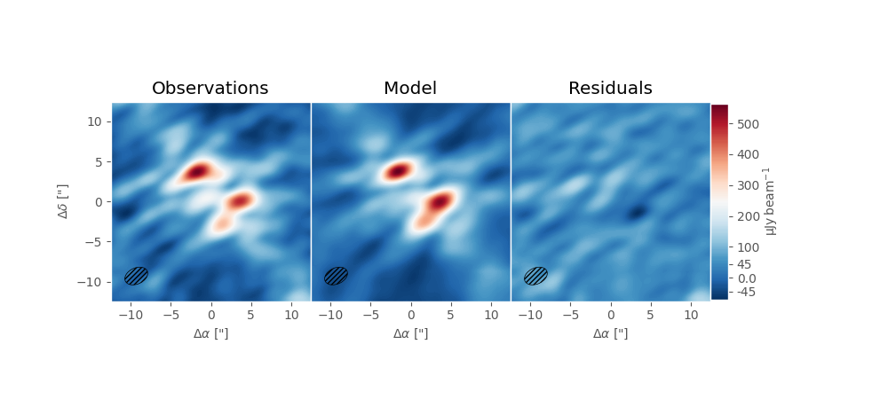
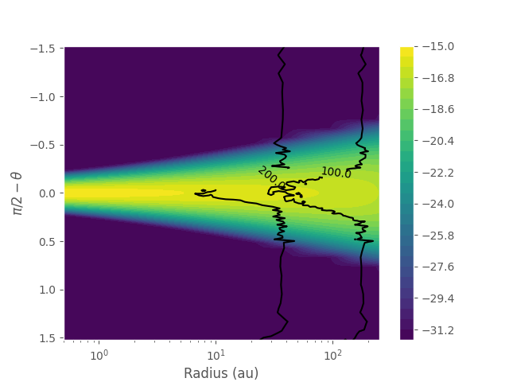
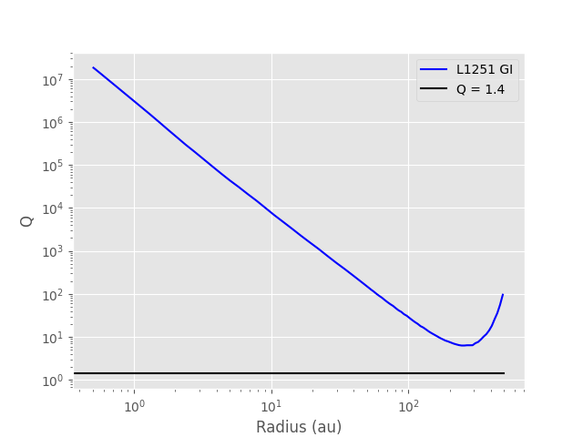

# MCMC-Model-Fitting

Run a Metropolis-Hastings MCMC with Gibbs Sampling model fitting procedure on VLA 33 GHz data
of L1251. The modelling approach picks random trial parameters which are then
passed into RADMC (Dullemond et al. 2012) to calculate the raditave transfer
equations of a given disk/star setup. The trial disk model is then convolved
with the syntethic beam of the VLA to simulate observations. The model and
33 GHz data are then used to calculated a modifed chi^2 statistic. A given 
trial model will be either accepted or rejected based on comparing the likelihood
function to a random number. This MCMC approach is adapted from the framework laid out in
White et al. 2017 (https://doi.org/10.1093/mnras/stw3303) and White 2018 (https://doi.org/10.14288/1.0368801). 
The inclusion of RADMC is adpated from the approach used in White et al 2020 (https://doi.org/10.3847/1538-4357/abbb94)
and Kospal et al. 2021 (https://doi.org/10.3847/1538-4365/ac0f09).

The analysis options included are: 

	PDF - calculating the posterior distributon functions (PDF) & plotting the walkers of the MCMC
	best_fit - generate a RADMC model of the most probable values
	plot_model_analytics - plot a 2D slice of the density map of the best fit
		model along with a radial profile of Toomre's Q parameter in the
		disk's midplane 
	plot_residual - make a data/model/residual plot of the best fit model

This script script the *mcmc_functions.py* script to load in all of the 
functions necessary for the MCMC and analysis.

The following input files (located in the fodler *input_files*) are required to run the script:
		
	dirty_imagejuly13.fits - A data FITS file
	pb_imagejuly13.fits - A primary beam FITS file
	beam_imagejuly13.fits - A synthetic beam FITS file
	dustkappa_silicate.inp- The input dust opacity and scattering file 

Dependencies:

	Python 3.6.8
	Numpy v1.6.2 or later
	SciPy 0.11.0 or later
	matplotlib 1.2.0 or later
	AstroPy v0.3 or later or Pyfits v3.0.7
	corner - https://doi.org/10.21105/joss.00024
	math
	os
	time
	sys
	glob

Also needed is the the complied RADMC3D binaries - 
	https://www.ita.uni-heidelberg.de/~dullemond/software/radmc-3d/manual_rmcpy/download.html

# Analysis Images

The output analytic plots include:

	PDFs
	walkers
	2D slice of RADMC model
	Radial profile of Toomre's Q parameter
	Data/Model/Residuals
  

Sample analysis figures created from the files in the *run_mcmc* folder are included in the *output_images* folder and are shown below.

<figure>

<figcaption> Figure 1: Posterior Distribution Functions (PDFs) of the 100x1000 link chains in the run_mcmc fodler. </figcaption>
</figure>

<figure>

<figcaption>Figure 2: Walkers for each parameter shown in the Figure 1. </figcaption>
</figure>

<figure>

<figcaption>Figure 3: Data/Model/Residual plot of the observational data, the best fit model, and the data minus model residuals. </figcaption>
</figure>

<figure>

<figcaption>Figure 4: 2D "slice" of the best fit disk. The plot shows the density as a function of raidus. Also included are 100 K and 200 K contours, a rough approximation of the area where the water iceline would be in the disk.  </figcaption>
</figure>

<figure>

<figcaption>Figure 5: Radial plot of Toomre's Q parameter in the disk midplane. The value of Q can be used to determine whether or not a disk is gravitationally unstable. Values of q < 1.4 indicate a gravitionally unstable disk which would be prone to collapse.  </figcaption>
</figure>

# Analysis without MCMC

Turn run the analysis components of the script, and not the MCMC, set *run_mcmc = False* in the *run_MCMC_L1251.py* script
and download the *run_mcmc* folder which contains 100x1000 chains. All of the included analysis scripts can run on these files.
